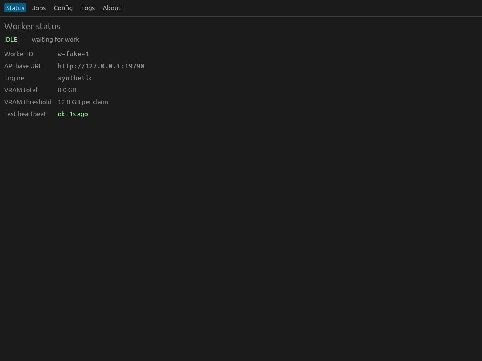

# studio-worker

[](https://github.com/webbertakken/studio-worker/actions/workflows/checks.yml)
[](https://github.com/webbertakken/studio-worker/actions/workflows/build.yml)
[](https://github.com/webbertakken/studio-worker/actions/workflows/coverage.yml)

A single self-contained Rust binary that pulls **image**, **LLM**,
**audio (STT/TTS)**, and **video** jobs from the minis.gg studio API,
runs them locally, and posts the results back.

Install the worker on any PC, register once, and it will hold a
hibernatable **WebSocket session** to the studio API's
`WorkerConnections` Durable Object.  The studio pushes job offers over
the socket as soon as they're queued; the worker accepts, runs the
engine, and posts the result back the same way (or via a single HTTP
multipart route for image / audio / video bytes).  The worker also
**auto-updates itself** between jobs.

```
  studio-worker binary <----- WebSocket -----> WorkerConnections DO <-> D1
         ^                                          ^
         |     HTTP multipart /complete             |
         +------------------------------------------+ (binary outputs only)
```

Replaces the previous push-based studio-proxy + cloudflared topology
and the intermediate pull-based polling pipeline.  All five legacy
worker HTTP routes (`heartbeat`, `claim`, `complete-json`, `fail`,
`logs`) are now WS frame types.

## Tasks supported

| Kind        | Wire `kind`   | Synthetic engine (default)                   | Real engine (planned)     |
| ----------- | ------------- | -------------------------------------------- | ------------------------- |
| Image       | `image`       | real WEBP / PNG via the `image` crate        | `image-candle` / `sd-cpp` |
| LLM         | `llm`         | OpenAI-shape JSON (`chat.completion`)        | `llama` (llama.cpp)       |
| Audio STT   | `audio_stt`   | Whisper-shape JSON                           | `whisper` (whisper.cpp)   |
| Audio TTS   | `audio_tts`   | real WAV (sine wave keyed by hash(text))     | `tts-piper`               |
| Video       | `video`       | real WebP image (single-frame stand-in)      | `video-ffmpeg`            |

The synthetic engine is the default and exercises the full pipeline
end-to-end with no GPU, no model downloads, and ~0 ms per task — exactly
what the unattended CI suite uses.  Real high-performance backends
(llama.cpp, whisper.cpp, candle, Piper, ffmpeg) are wired in via
feature flags and are deferred to a follow-up iteration (the trait,
contract, and dispatch are already in place).

## Desktop UI (on by default)

The worker ships a native desktop window built on `egui`/`eframe` that
surfaces every config knob, the live job in flight, the recent-jobs
history, the rolling log tail, and a system-tray icon with Open /
Pause-Resume / Quit.  It is **on by default** — `cargo install
studio-worker` gives you the windowed worker, and `studio-worker ui`
launches it.

The UI build is free of GTK: the window uses `eframe`/`glow` (OpenGL via
dlopen), notifications use `notify-rust` (pure-Rust zbus on Linux), and
the system tray uses `ksni` (pure-Rust StatusNotifierItem) on Linux and
the native `tray-icon` APIs on macOS / Windows.  So a source build needs
**no `pkg-config`, no `-dev` packages, and no OpenSSL** (reqwest +
sentry use rustls).  Headless rigs can still opt out:

```bash
cargo install studio-worker --no-default-features   # service / `run` only
```

Five tabs:

| Tab     | What it shows                                                     |
| ------- | ----------------------------------------------------------------- |
| Status  | Worker id, API URL, VRAM total + threshold, busy / idle / paused badge, last heartbeat age + outcome.  When the worker isn't registered, an in-window Register form. |
| Jobs    | Current job in flight (kind, model, prompt, elapsed time) + bounded ring of the last 50 finished jobs with completed / failed badges. |
| Config  | Every `config.toml` field as an editable widget grouped into Connection / Worker / Engine / Auto-update / Models / Notifications / Background mode.  Save writes through `config::save` and the runtime picks up new values on the next tick.  Engine swaps surface a "restart required" banner. |
| Logs    | Level filter (info / warn / error), free-text search across category / message / job id, auto-scroll toggle, windowed at the last 500 entries. |
| About   | Version, Sentry release name, resolved config path, "Check for updates" button. |



The tray icon reflects state (idle = green, busy = amber,
disconnected = red) and exposes:

- **Open Window** — re-show the window after hide-to-tray.
- **Pause / Resume claiming** — toggles `auto_enabled`, persisted to
  `config.toml`.
- **Quit** — signals the runtime loops to stop, awaits any in-flight
  job briefly, then exits.

Closing the window hides it to the tray; the worker keeps running.
For an autostart-on-login workflow, tick the **Run in tray on login**
toggle on the Config tab (writes `~/.config/autostart/studio-worker-ui.desktop`
on Linux, a LaunchAgent plist on macOS, an `HKCU\…\Run` registry
value on Windows).

### Build-time deps

None for the UI itself on any platform — that's the point of the
GTK-free stack above (no `pkg-config`, no `cairo`/`gtk` `-dev`
packages, no OpenSSL).  A standard Rust toolchain is enough.

The **all-backends** build (`--features all`, used for the release
binaries) additionally compiles `llama.cpp` in-process, which needs
`cmake` + a C/C++ toolchain.  The release runners install `cmake`
automatically (cargo-dist system dependency); for a local
`cargo install studio-worker --features all` make sure `cmake` and a
C++ compiler are on `PATH`.

## Quick install

### Linux / macOS

```bash
curl --proto '=https' --tlsv1.2 -LsSf \
  https://github.com/webbertakken/studio-worker/releases/latest/download/studio-worker-installer.sh | sh
```

### Windows (PowerShell)

```powershell
irm https://github.com/webbertakken/studio-worker/releases/latest/download/studio-worker-installer.ps1 | iex
```

### From cargo

```bash
cargo install studio-worker              # windowed UI by default
cargo install studio-worker --features all   # + in-process llama.cpp + media (needs cmake)
cargo install studio-worker --no-default-features  # headless service build
```

The **install script is the turnkey path**: its pre-built binaries
already bundle the UI **and** every backend (in-process llama.cpp LLM +
media engines), auto-start on login, auto-update, and auto-download
models on demand — nothing else to install.  `cargo install
studio-worker` from source is UI-first but ships only the synthetic
engine unless you add `--features all` (which needs a C/C++ toolchain).

Each release ships pre-built binaries for:

- `x86_64-pc-windows-msvc`
- `x86_64-unknown-linux-gnu`
- `aarch64-unknown-linux-gnu`
- `aarch64-apple-darwin`
- `x86_64-apple-darwin`

## First run

No shared secret to copy around.  The worker auto-registers against
`https://studio.minis.gg` on first launch; the studio operator sees a
row in the dashboard's Pending Workers panel and clicks Approve, and
the worker's next 30s poll picks up its `worker_id` + `auth_token`
and starts heartbeating.  Two ways to launch:

```bash
# Windowed (recommended) — Status tab shows 'Waiting for approval'
# until the operator approves.
studio-worker ui

# Headless — same flow, no window; pipe to journalctl in production.
studio-worker run
```

Optional pre-launch tweaks (none of these talk to the network):

```bash
# Pre-set the human label shown in the dashboard's Pending Workers panel.
studio-worker register --label "alice's gaming rig"

# Point at a self-hosted studio instead of studio.minis.gg.
studio-worker register --api-base-url https://my-studio.example.com

# Optionally install the auto-start OS service (systemd --user on Linux,
# launchd on macOS, scheduled task on Windows).  Alternative: the desktop
# UI's Config tab has a `Run in tray on login` toggle.
studio-worker install-service
```

If your registration is rejected (or you want to move the worker to a
different studio), clear the local state and submit a fresh request:

```bash
studio-worker register --reset
```

## CLI subcommands

| Subcommand           | Purpose                                                         |
| -------------------- | --------------------------------------------------------------- |
| `run`                | Auto-register if needed, then hold the WS session + auto-update loop. |
| `ui` (default)       | Same as `run` plus the desktop window + tray + notifications. Built unless installed with `--no-default-features`. |
| `register`           | Persist `--label` / `--api-base-url`; `--reset` clears local state. |
| `status`             | Print the local config + registration state.                    |
| `install-service`    | Install the auto-start OS service.                              |
| `uninstall-service`  | Remove the auto-start OS service.                               |
| `enable`             | Set `auto_enabled = true` (resume claiming).                    |
| `disable`            | Set `auto_enabled = false` (worker online but doesn't claim).   |
| `set-threshold <gb>` | Set the max VRAM (GB) the worker is willing to claim per job.   |
| `config`             | Print the resolved config + its on-disk path.                   |
| `check-update`       | Check the release feed for a newer version (does not install).  |

## Configuration

Config lives at:

- Linux/macOS — `~/.config/minis-studio-worker/config.toml`
- Windows — `%APPDATA%\minis-studio-worker\config.toml`

```toml
api_base_url        = "https://studio.minis.gg"
worker_id           = "<filled on operator approval>"
auth_token          = "<filled on operator approval>"
vram_threshold_gb   = 12.0                       # max GB per claim
auto_start          = true

# Where on-demand model files are cached (defaults to ~/models).
models_root         = "~/models"

# Auto-update — checks the release feed on the cadence below, applies
# updates only when no job is running, then re-execs the new binary.
auto_update_enabled       = true
auto_update_interval_secs = 1800
auto_update_feed          = "https://api.github.com/repos/webbertakken/studio-worker/releases"
auto_update_prerelease    = false

# WebSocket reconnect cap.  When the session drops the worker tries
# to reconnect with exponential backoff up to this many times before
# exiting non-zero (and letting systemd/launchd/Task-Scheduler
# restart it).  `0` = infinite.  Omit to use the default of 5.
ws_reconnect_attempts     = 5

# Internal state written by the auto-register flow.  Don't edit by hand.
install_id              = "<uuidv4>"
registration_request_id = "<rr-...>"             # cleared on approval
registration_secret     = "<hex>"                # cleared on approval
```

## Registration flow

The worker doesn't ship a shared secret.  On first launch:

1. Generates a per-install UUID + 256-bit `registration_secret` and
   keeps both in `config.toml`.  Only the SHA-256 hash of the secret
   leaves the box.
2. POSTs `/workers/register-request` to `api_base_url` with hostname,
   username, VRAM, supported models, optional label.
3. The studio creates a Pending Workers row.  The operator sees it in
   the studio dashboard, clicks Approve (or Reject), and the worker's
   next 30s poll picks up the decision.
4. On Approve: `worker_id` + `auth_token` written to `config.toml`,
   normal heartbeat / claim loops take over.
5. On Reject: worker stops trying.  `studio-worker register --reset`
   clears state and the next launch submits a fresh request.

See [`docs/architecture/overview.md`](docs/architecture/overview.md#registration-auto-register-with-approval)
for the full state machine + per-install identity details.

## Troubleshooting

- **Worker exits with `ws auth failed: ...`** — the studio API rejected
  the auth token on the upgrade (HTTP 401) or via a close-code 4001
  after a successful upgrade.  The token was either revoked, the
  worker was deleted from the studio admin UI, or `config.toml`
  carries a stale token.  Clear local state and let the next launch
  auto-register again: `studio-worker register --reset` then
  `studio-worker run` (or `studio-worker ui`).
- **Worker exits with `ws reconnect cap reached`** — every reconnect
  attempt failed (DNS, TLS, or the API is down).  Service manager will
  restart us; if it keeps happening, check the API is reachable from
  the worker host.

## Engines

There's no engine-selection knob in the config.  The worker advertises
capabilities for every backend compiled into the binary and routes each
incoming job to the first backend that supports its `(kind, model)` pair
(see [`MultiEngine`](src/engine/multi.rs)).

- **`synthetic`** (always present, last in the chain) — produces
  deterministic, real WEBP/PNG/WAV/JSON outputs keyed by SHA-256 of the
  prompt/text/input.  No GPU required.  Use for smoke-tests, CI, and
  end-to-end verification of every modality.
- **`sd-cpp`** — real image inference via `stable-diffusion.cpp` as a
  subprocess.  Self-registers only when the `sd-cli` binary and at least
  one model's files are present under `models_root`.  See
  [`docs/engines/sdcpp.md`](docs/engines/sdcpp.md).
- **`llama`** — real LLM inference via `llama.cpp` linked in-process
  (`llama-cpp-2`).  Shipped in the release binaries (and any
  `--features all` / `--features llama` build); downloads the GGUF named
  by the offer's `ModelSource` into `<models_root>/llm/` on demand and
  advertises the `llama-cpp:*` wildcard so a fresh worker is claimable.
- **feature-gated heavyweights** — `whisper` (STT), `image-candle`
  (pure-Rust SD), `video`, `tts` drop in via the same trait when their
  cargo feature is enabled.  `whisper` and `llama` each static-link
  their own `ggml`, which can't coexist in one binary, so `whisper`
  ships in its own bundle (`all-engines-stt`); the all-backends release
  pairs `llama` (in-process) with `sd-cli` (subprocess) to sidestep the
  clash.

When the studio offers a model whose engine isn't compiled into the
worker, the job fails loudly with an actionable message (install the
all-backends release, or rebuild with `--features all`) rather than
silently producing placeholder bytes.

### Adding a real engine

Implement the `Engine` trait under `src/engine/` (see `SyntheticEngine`
and `SdCppEngine` for examples).  An engine declares its `capabilities`
(per-kind supported models) and a `dispatch(model, task) -> TaskResult`
function.  Wire it into `engine::build()` behind a cargo feature, e.g.:

```toml
[features]
llama = ["dep:llama-cpp-2"]
```

The trait is already kind-aware so a single binary can host multiple
engines (one per modality).

## VRAM threshold

The worker reports two numbers to the API:

- `vramTotalGb` — physical VRAM on the host (probed from
  `/proc/driver/nvidia` on Linux; `0` when no NVIDIA GPU is present).
- `vramThresholdGb` — the **max** estimated VRAM per claim, controlled by
  the operator via `set-threshold` or by editing `config.toml`.

The studio API only hands a job to a worker if `job.vramGbEstimate ≤
worker.vramThresholdGb` **and** `job.model ∈ worker.supportedModels`.
Jobs that no worker can take stay `queued` until either a suitable worker
appears or the operator cancels.

## Auto-update

A dedicated background task polls the GitHub Releases feed every
`auto_update_interval_secs` (default 30 min).  When a higher semver is
available the worker:

1. Confirms no job is currently in flight (per a shared `busy` flag).
2. Downloads the cargo-dist installer for the current platform.
3. Runs it (it overwrites the binary in place).
4. Re-execs itself so the new code takes over.

Set `auto_update_enabled = false` to opt out.  Set
`auto_update_prerelease = true` to track pre-releases.

## Observability

The worker batches log entries every second and pushes them as a
`logBatch` frame over the WS session.  The DO ingests them into the
`workerLogs` D1 table; the studio LogViewer reads them from there.

### Sentry (opt-in)

The worker integrates with [Sentry](https://sentry.io) for crash + error
reporting.  Disabled by default — set the following env vars before
launching to enable it:

| Env var              | Purpose                                              |
| -------------------- | ---------------------------------------------------- |
| `SENTRY_DSN`         | The project DSN.  Telemetry stays off when unset.    |
| `SENTRY_ENVIRONMENT` | Optional environment tag (defaults to `production`). |

When enabled the worker:

- captures panics automatically (`sentry`'s default panic handler);
- forwards `tracing::error!` events as Sentry events;
- attaches preceding `tracing::warn!` events as breadcrumbs;
- tags every event with the worker's `release` (= `studio-worker@<crate version>`,
  the Sentry-conventional namespaced form) and hostname (`server_name`).

No DSN is baked into the binary, so the public repo never carries
credentials.  Performance tracing is intentionally off — Sentry is used
purely for error/crash visibility.

## Development

```bash
cargo test                              # default (UI) build
cargo test --no-default-features        # headless core
cargo test --features all               # + llama.cpp + candle (needs cmake)
cargo clippy --tests -- -D warnings
cargo fmt --check
# Coverage gates the headless core (UI rendering isn't unit-testable).
# Use nightly: the crate's `#[coverage(off)]` exclusions only take
# effect under the `coverage_nightly` cfg cargo-llvm-cov sets there.
cargo +nightly llvm-cov --workspace --no-default-features \
  --ignore-filename-regex 'src/main\.rs$|src/engine/sdcpp\.rs$|src/ws/session\.rs$' \
  --summary-only
```

Coverage CI enforces **≥ 90% line coverage** on the headless core, on
the **nightly** toolchain so the `#[cfg_attr(coverage_nightly,
coverage(off))]` exclusions below actually drop out of the measurement.
Truly-untestable bits excluded from the gate:

- `src/main.rs` — the CLI bootstrap (all logic lives in `lib.rs`).
- `src/engine/sdcpp.rs`, `src/ws/session.rs` — subprocess / live-socket
  paths exercised by the dev loop, not unit tests.
- the `ui` feature (egui rendering + OS tray glue) — not unit-testable;
  excluded by gating coverage on `--no-default-features`.
- `update::RealRunner::{download, run_installer}` — real network +
  process spawn (tested through the `UpdateRunner` trait with a fake).
- `update::restart_self` — calls `execvp`, never returns.
- `sys::detect_vram_gb` NVIDIA-specific branch — requires NVIDIA hardware.

Integration tests live under `tests/`:

- `tests/ws_wire.rs` — round-trip tests for every `WorkerInbound` /
  `WorkerOutbound` frame against the TS contract.
- `tests/ws_client_contract.rs` — the WS client against a live
  tokio-tungstenite server (upgrade headers, hello roundtrip, 401 →
  AuthFailed, close 4001 → AuthFailed, binary-frame rejection, close
  idempotency).
- `tests/ws_session_full_loop.rs` — end-to-end walk: hello → welcome
  → LLM offer → accept + completeJson → STT offer → accept +
  completeJson → clean close.
- `tests/http_contract.rs` — register + multipart `complete` (image
  + audio) against wiremock.
- `tests/http_errors.rs` — error-status paths for register +
  multipart `complete` plus the tracing-emission contract.
- `tests/multi_modal.rs` — every TaskKind round-trips through the
  synthetic engine + decoders.
- `tests/auto_update.rs` — release feed parsing + apply_with full flow.
- `tests/runtime_helpers.rs` — one-shot CLI helpers via wiremock.
- `tests/runtime_ticks.rs` — auto-update ticks + `run_returns_when_aborted`
  smoke test that exercises the AuthFailed exit path.

## Release process

1. PRs merge to `main` with conventional-commit titles
   (`feat:`, `fix:`, `docs:`, etc. — enforced by the Commit lint workflow).
2. `release-please` opens a release PR that bumps the version and updates
   the changelog.
3. Merging the release PR creates a git tag.
4. The tag triggers the `release.yml` workflow (cargo-dist), which builds
   binaries for all supported targets and uploads them to the GitHub
   release alongside `installer.sh` + `installer.ps1` one-liners.

## Licence

MIT.  See [LICENSE](./LICENSE).
