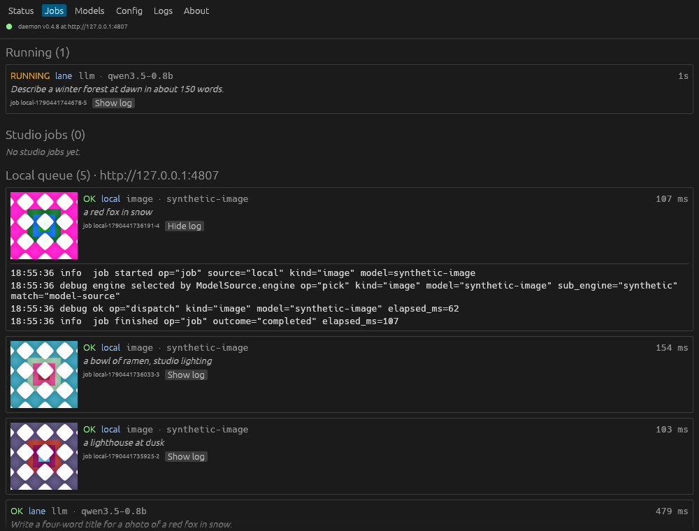

# studio-worker

[](https://github.com/webbertakken/studio-worker/actions/workflows/checks.yml)
[](https://github.com/webbertakken/studio-worker/actions/workflows/build.yml)
[](https://github.com/webbertakken/studio-worker/actions/workflows/coverage.yml)

A single self-contained Rust binary that pulls **image**, **LLM**,
**audio (STT/TTS)**, and **video** jobs from the minis.gg studio API,
runs them locally, and posts the results back.

Install the worker on any PC, register once, and it will hold a
hibernatable **WebSocket session** to the studio API's
`WorkerConnections` Durable Object.  The studio pushes job offers over
the socket as soon as they're queued; the worker accepts, runs the
engine, and posts the result back the same way (or via a single HTTP
multipart route for image / audio / video bytes).  The worker also
**auto-updates itself** between jobs.

```
  studio-worker binary <----- WebSocket -----> WorkerConnections DO <-> D1
         ^                                          ^
         |     HTTP multipart /complete             |
         +------------------------------------------+ (binary outputs only)
```

Replaces the previous push-based studio-proxy + cloudflared topology
and the intermediate pull-based polling pipeline.  All five legacy
worker HTTP routes (`heartbeat`, `claim`, `complete-json`, `fail`,
`logs`) are now WS frame types.

## Tasks supported

| Kind        | Wire `kind`   | Synthetic engine (default)                   | Real engine (planned)     |
| ----------- | ------------- | -------------------------------------------- | ------------------------- |
| Image       | `image`       | real WEBP / PNG via the `image` crate        | `image-candle` / `sd-cpp` |
| LLM         | `llm`         | OpenAI-shape JSON (`chat.completion`)        | `llama` (llama.cpp)       |
| Audio STT   | `audio_stt`   | Whisper-shape JSON                           | `whisper` (whisper.cpp)   |
| Audio TTS   | `audio_tts`   | real WAV (sine wave keyed by hash(text))     | `tts-piper`               |
| Video       | `video`       | real WebP image (single-frame stand-in)      | `video-ffmpeg`            |

The synthetic engine is the default and exercises the full pipeline
end-to-end with no GPU, no model downloads, and ~0 ms per task — exactly
what the unattended CI suite uses.  Real high-performance backends
(llama.cpp, whisper.cpp, candle, Piper, ffmpeg) are wired in via
feature flags and are deferred to a follow-up iteration (the trait,
contract, and dispatch are already in place).

## Local image API (no studio)

The worker also runs an always-on local HTTP API (`127.0.0.1:4787`) so you can
generate images locally — e.g. Z-Image — without going through the studio:

```bash
DISCOVERY=~/.config/minis-studio-worker/local-api.json   # holds url + bearer token
curl -s "$(jq -r .url $DISCOVERY)/image" \
  -H "authorization: Bearer $(jq -r .token $DISCOVERY)" \
  -H 'content-type: application/json' \
  -d '{"prompt":"a red fox in snow"}' --output fox.webp
```

The API requires a per-install bearer token (auto-generated; published in
the owner-only `local-api.json` discovery file next to `config.toml`) and
rejects non-loopback `Host`/`Origin` headers, so hostile web pages can't
drive your GPU via CSRF or DNS rebinding.

Models come from a local catalog (`<config dir>/models.json`, seeded with
Z-Image) that you can extend the same way the studio adds models. Local jobs
show up in the tray UI's **Local queue**. See
[`docs/local-api.md`](docs/local-api.md).

## Tray UI

Installed, the worker always runs as its tray UI, so you can always see
whether it runs.  It is two processes from one binary: the **daemon**
hosts the studio session, the local API, the model
host and every job; the **tray UI** (`studio-worker ui`) is a native
`egui`/`eframe` window and system-tray icon that shows what the daemon
does and sends your actions back over the local API.  The UI starts the
daemon when none is running, starts itself at every login (always; there
is no setting to turn that off), and waits for the display when the
graphical session is not ready yet.  Design:
[`docs/runtime/daemon-and-tray.md`](docs/runtime/daemon-and-tray.md).

The UI build is free of GTK: the window uses `eframe`/`glow` (OpenGL via
dlopen), notifications use `notify-rust` (pure-Rust zbus on Linux), and
the system tray uses `ksni` (pure-Rust StatusNotifierItem) on Linux and
the native `tray-icon` APIs on macOS / Windows.  So a source build needs
**no `pkg-config`, no `-dev` packages, and no OpenSSL** (reqwest +
sentry use rustls).

The window is a navigation rail, a header that always shows the worker's
pulse (what runs, the daemon, the studio, GPU memory held, Pause / Resume)
and a status bar with the result of your last action.  It opens on Jobs.

| Page    | What it shows                                                     |
| ------- | ----------------------------------------------------------------- |
| Jobs    | What runs now (studio offers, local API jobs, chats on a loaded model, streaming speech sessions) and every finished job, grouped by day and filterable by studio / local.  Selecting a job shows its image (click it to view larger), its facts, its failure reason and its log (coloured, wrapping, copyable). |
| Models  | GPU memory held by loaded models, then each catalogue model's state, residency and memory estimate, with Load / Unload / Retry. |
| Worker  | State and Pause / Resume, registration (request id while waiting for approval; Reset after a rejection), studio connection and heartbeat, GPU runtime and VRAM, local API URL, versions, config path, "Check for updates". |
| Logs    | Everything the daemon logs: level filter, search, follow, copy. |
| Config  | The operator-editable settings (Save sends them to the daemon, which validates, saves and applies them), and this window's theme (dark, light or follow system), reduce motion and notifications. |



While the daemon does not answer, the pages show a "daemon not reachable"
card rather than stale data.  One tray UI runs per config: launching it
again brings the running window forward instead of adding a second tray
icon.

The tray icon reflects state (idle = green, busy = amber,
disconnected = red) and exposes:

- **Open Window** — re-show the window after hide-to-tray.
- **Pause / Resume** — stop / resume claiming studio jobs (runtime-only).
- **Quit** — stops the daemon (it lets an in-flight job finish briefly)
  and closes the UI.

Closing the window hides it to the tray; the daemon keeps running.

### Build-time deps

None for the UI itself on any platform — that's the point of the
GTK-free stack above (no `pkg-config`, no `cairo`/`gtk` `-dev`
packages, no OpenSSL).  A standard Rust toolchain is enough.

The **all-backends** build (`--features all`, used for the release
binaries) additionally compiles `llama.cpp` in-process, which needs
`cmake` + a C/C++ toolchain.  The release runners install `cmake`
automatically (cargo-dist system dependency); for a local
`cargo install studio-worker --features all` make sure `cmake` and a
C++ compiler are on `PATH`.

## Quick install

### Linux / macOS

```bash
curl --proto '=https' --tlsv1.2 -LsSf \
  https://github.com/webbertakken/studio-worker/releases/latest/download/studio-worker-installer.sh | sh
```

### Windows (PowerShell)

```powershell
irm https://github.com/webbertakken/studio-worker/releases/latest/download/studio-worker-installer.ps1 | iex
```

The installer finishes by running `studio-worker setup`: it starts the
tray UI (look for its icon) and installs its login entry, so the worker
runs now and at every login, then prints the machine name the studio
admin approves, the studio URL, and where the local API's URL + token
are written.  `setup` is idempotent; run it yourself after a
`cargo install`.  A headless service from an older version is removed
when the tray UI starts. After an admin approves the worker it
claims jobs automatically and downloads its own models + GPU runtimes
on demand; there is nothing else to do.

### From cargo

```bash
cargo install studio-worker              # the tray UI and the turnkey engines (needs cmake)
studio-worker setup                      # start the tray UI, now and at every login
```

The **install script is the turnkey path**: its pre-built binaries
already bundle the UI **and** every backend (in-process llama.cpp LLM +
media engines), auto-start on login, auto-update, and auto-download
models on demand — nothing else to install.  `cargo install
studio-worker` builds the same turnkey set from source and needs a C/C++
toolchain (cmake) for llama.cpp.

Each release ships pre-built binaries for:

- `x86_64-pc-windows-msvc`
- `x86_64-unknown-linux-gnu`, in two variants: CPU and **CUDA**
- `aarch64-unknown-linux-gnu`
- `aarch64-apple-darwin`
- `x86_64-apple-darwin`

### NVIDIA GPUs (x86_64 Linux)

On x86_64 Linux the install script picks the **CUDA build** when the NVIDIA
driver is installed (it looks for `libcuda.so.1`), and the CPU build
otherwise; it prints which one.  The CUDA build runs the in-process LLM
with every layer on the GPU: on an RTX 4090 a 0.8B model answers a
3,600-token chat in 0.3 s, against 13.5 s on the CPU.  It needs only the
driver (525 or newer), not the CUDA toolkit, and covers GTX 10xx through
RTX 50xx and datacentre GPUs from V100 to H100.  It is a larger download:
565 MB against 10 MB.  Auto-update keeps a CUDA install on
CUDA, and moves a CPU install to CUDA once the driver is installed.  To choose
yourself:

```bash
curl --proto '=https' --tlsv1.2 -LsSf \
  https://github.com/webbertakken/studio-worker/releases/latest/download/studio-worker-installer.sh \
  | STUDIO_WORKER_VARIANT=cpu sh     # or cuda
```

`studio-worker --version` names the build: `studio-worker 0.4.13 (cuda)`.
Windows and macOS have no CUDA build.  Details:
[`docs/operations/release.md`](docs/operations/release.md#cuda-variant).

## First run

No shared secret to copy around.  The worker auto-registers against
`https://studio.minis.gg` on first launch; the studio operator sees a
row in the dashboard's Pending Workers panel and clicks Approve, and
the worker's next 30s poll picks up its `worker_id` + `auth_token`
and starts heartbeating.  The tray UI's Worker page shows `Waiting for
approval` until then.  To open it by hand: `studio-worker ui`.

Optional pre-launch tweaks (none of these talk to the network):

```bash
# Point at a self-hosted studio instead of studio.minis.gg.
studio-worker register --api-base-url https://my-studio.example.com
```

If your registration is rejected (or you want to move the worker to a
different studio), clear the local state and submit a fresh request:

```bash
studio-worker register --reset
```

## CLI subcommands

| Subcommand           | Purpose                                                         |
| -------------------- | --------------------------------------------------------------- |
| `setup`              | Start the tray UI and install its login entry; print the approval guidance.  The installers run it. |
| `ui`                 | The tray UI, a client of the daemon (starts one if none runs). |
| `register`           | Persist `--api-base-url`; `--reset` clears local state. |
| `status`             | Print the local config + registration state.                    |
| `set-threshold <gb>` | Set the max VRAM (GB) the worker is willing to claim per job.   |
| `config`             | Print the resolved config + its on-disk path.                   |
| `check-update`       | Check the release feed for a newer version (does not install).  |

## Configuration

Config lives at:

- Linux/macOS — `~/.config/minis-studio-worker/config.toml`
- Windows — `%APPDATA%\minis-studio-worker\config.toml`

```toml
api_base_url        = "https://studio.minis.gg"
worker_id           = "<filled on operator approval>"
auth_token          = "<filled on operator approval>"
vram_threshold_gb   = 12.0                       # max GB per claim
start_minimised     = true                       # tray UI window starts minimised

# Where on-demand model files are cached (defaults to ~/models).
models_root         = "~/models"

# Auto-update — checks the release feed on the cadence below, applies
# updates only when no job is running, then re-execs the new binary.
auto_update_enabled       = true
auto_update_interval_secs = 1800
auto_update_feed          = "https://api.github.com/repos/webbertakken/studio-worker/releases"
auto_update_prerelease    = false

# WebSocket reconnect cap.  When the session drops the worker tries
# to reconnect with exponential backoff up to this many times before
# exiting non-zero (the tray UI then starts a new daemon).
# `0` = infinite, the default when omitted.
ws_reconnect_attempts     = 0

# Internal state written by the auto-register flow.  Don't edit by hand.
install_id              = "<uuidv4>"
registration_request_id = "<rr-...>"             # cleared on approval
registration_secret     = "<hex>"                # cleared on approval
```

## Registration flow

The worker doesn't ship a shared secret.  On first launch:

1. Generates a per-install UUID + 256-bit `registration_secret` and
   keeps both in `config.toml`.  Only the SHA-256 hash of the secret
   leaves the box.
2. POSTs `/workers/register-request` to `api_base_url` with hostname,
   username, VRAM, supported models, optional label.
3. The studio creates a Pending Workers row.  The operator sees it in
   the studio dashboard, clicks Approve (or Reject), and the worker's
   next 30s poll picks up the decision.
4. On Approve: `worker_id` + `auth_token` written to `config.toml`,
   normal heartbeat / claim loops take over.
5. On Reject: worker stops trying.  `studio-worker register --reset`
   clears state and the next launch submits a fresh request.

See [`docs/architecture/overview.md`](docs/architecture/overview.md#registration-auto-register-with-approval)
for the full state machine + per-install identity details.

## Troubleshooting

- **Worker exits with `ws auth failed: ...`** — the studio API rejected
  the auth token on the upgrade (HTTP 401) or via a close-code 4001
  after a successful upgrade.  The token was either revoked, the
  worker was deleted from the studio admin UI, or `config.toml`
  carries a stale token.  Clear local state and let the next launch
  auto-register again: `studio-worker register --reset`, then quit
  the tray UI and start it again (`studio-worker ui`).
- **Worker exits with `ws reconnect cap reached`** — every reconnect
  attempt failed (DNS, TLS, or the API is down).  The tray UI starts
  a new daemon; if it keeps happening, check the API is reachable from
  the worker host.

## Engines

There's no engine-selection knob in the config.  The worker advertises
capabilities for every backend compiled into the binary and routes each
incoming job to the first backend that supports its `(kind, model)` pair
(see [`MultiEngine`](src/engine/multi.rs)).

- **`synthetic`** (always present, last in the chain) — produces
  deterministic, real WEBP/PNG/WAV/JSON outputs keyed by SHA-256 of the
  prompt/text/input.  No GPU required.  Use for smoke-tests, CI, and
  end-to-end verification of every modality.
- **`sd-cpp`** — real image inference via `stable-diffusion.cpp` as a
  subprocess.  Self-registers only when the `sd-cli` binary and at least
  one model's files are present under `models_root`.  See
  [`docs/engines/sdcpp.md`](docs/engines/sdcpp.md).
- **`llama`** — real LLM inference via `llama.cpp` linked in-process
  (`llama-cpp-2`).  Shipped in the release binaries (and any
  `--features all` / `--features llama` build); downloads the GGUF named
  by the offer's `ModelSource` into `<models_root>/llm/` on demand and
  advertises the `llama-cpp:*` wildcard so a fresh worker is claimable.
- **feature-gated heavyweights** — `whisper` (STT), `image-candle`
  (pure-Rust SD), `video`, `tts` drop in via the same trait when their
  cargo feature is enabled.  `whisper` and `llama` each static-link
  their own `ggml`, which can't coexist in one binary, so `whisper`
  ships in its own bundle (`all-engines-stt`); the all-backends release
  pairs `llama` (in-process) with `sd-cli` (subprocess) to sidestep the
  clash.

When the studio offers a model whose engine isn't compiled into the
worker, the job fails loudly with an actionable message (install the
all-backends release, or rebuild with `--features all`) rather than
silently producing placeholder bytes.

### Adding a real engine

Implement the `Engine` trait under `src/engine/` (see `SyntheticEngine`
and `SdCppEngine` for examples).  An engine declares its `capabilities`
(per-kind supported models) and a `dispatch(model, task) -> TaskResult`
function.  Wire it into `engine::build()` behind a cargo feature, e.g.:

```toml
[features]
llama = ["dep:llama-cpp-2"]
```

The trait is already kind-aware so a single binary can host multiple
engines (one per modality).

## VRAM threshold

The worker reports two numbers to the API:

- `vramTotalGb` — physical VRAM on the host (probed from
  `/proc/driver/nvidia` on Linux; `0` when no NVIDIA GPU is present).
- `vramThresholdGb` — the **max** estimated VRAM per claim, controlled by
  the operator via `set-threshold` or by editing `config.toml`.

The studio API only hands a job to a worker if `job.vramGbEstimate ≤
worker.vramThresholdGb` **and** `job.model ∈ worker.supportedModels`.
Jobs that no worker can take stay `queued` until either a suitable worker
appears or the operator cancels.

## Auto-update

A dedicated background task polls the GitHub Releases feed every
`auto_update_interval_secs` (default 30 min).  When a higher semver is
available the worker:

1. Confirms no job is currently in flight (per a shared `busy` flag).
2. Downloads the cargo-dist installer for the current platform.
3. Runs it (it overwrites the binary in place).
4. Re-execs itself so the new code takes over; the tray UI notices its
   binary was replaced and restarts itself on it too.

Set `auto_update_enabled = false` to opt out.  Set
`auto_update_prerelease = true` to track pre-releases.

## Observability

The worker batches log entries every second and pushes them as a
`logBatch` frame over the WS session.  The DO ingests them into the
`workerLogs` D1 table; the studio LogViewer reads them from there.

### Sentry (opt-in)

The worker integrates with [Sentry](https://sentry.io) for crash + error
reporting.  Disabled by default — set the following env vars before
launching to enable it:

| Env var              | Purpose                                              |
| -------------------- | ---------------------------------------------------- |
| `SENTRY_DSN`         | The project DSN.  Telemetry stays off when unset.    |
| `SENTRY_ENVIRONMENT` | Optional environment tag (defaults to `production`). |

When enabled the worker:

- captures panics automatically (`sentry`'s default panic handler);
- forwards `tracing::error!` events as Sentry events;
- attaches preceding `tracing::warn!` events as breadcrumbs;
- tags every event with the worker's `release` (= `studio-worker@<crate version>`,
  the Sentry-conventional namespaced form) and hostname (`server_name`).

No DSN is baked into the binary, so the public repo never carries
credentials.  Performance tracing is intentionally off — Sentry is used
purely for error/crash visibility.

## Development

```bash
cargo test                              # default (UI) build
cargo test --no-default-features        # headless core (CI only, never installed)
cargo test --features all               # + llama.cpp + candle (needs cmake)
cargo clippy --tests -- -D warnings
cargo fmt --check
# Coverage gates the headless core (UI rendering isn't unit-testable).
# Use nightly: the crate's `#[coverage(off)]` exclusions only take
# effect under the `coverage_nightly` cfg cargo-llvm-cov sets there.
cargo +nightly llvm-cov --workspace --no-default-features \
  --ignore-filename-regex 'src/main\.rs$|src/engine/sdcpp\.rs$|src/ws/session\.rs$' \
  --summary-only
```

Coverage CI enforces **≥ 90% line coverage** on the headless core, on
the **nightly** toolchain so the `#[cfg_attr(coverage_nightly,
coverage(off))]` exclusions below actually drop out of the measurement.
Truly-untestable bits excluded from the gate:

- `src/main.rs` — the CLI bootstrap (all logic lives in `lib.rs`).
- `src/engine/sdcpp.rs`, `src/ws/session.rs` — subprocess / live-socket
  paths exercised by the dev loop, not unit tests.
- the `ui` feature (egui rendering + OS tray glue) — not unit-testable;
  excluded by gating coverage on `--no-default-features`.
- `update::RealRunner::{download, run_installer}` — real network +
  process spawn (tested through the `UpdateRunner` trait with a fake).
- `update::restart_self` — calls `execvp`, never returns.
- `sys::detect_vram_gb` NVIDIA-specific branch — requires NVIDIA hardware.

Integration tests live under `tests/`:

- `tests/ws_wire.rs` — round-trip tests for every `WorkerInbound` /
  `WorkerOutbound` frame against the TS contract.
- `tests/ws_client_contract.rs` — the WS client against a live
  tokio-tungstenite server (upgrade headers, hello roundtrip, 401 →
  AuthFailed, close 4001 → AuthFailed, binary-frame rejection, close
  idempotency).
- `tests/ws_session_full_loop.rs` — end-to-end walk: hello → welcome
  → LLM offer → accept + completeJson → STT offer → accept +
  completeJson → clean close.
- `tests/http_contract.rs` — register + multipart `complete` (image
  + audio) against wiremock.
- `tests/http_errors.rs` — error-status paths for register +
  multipart `complete` plus the tracing-emission contract.
- `tests/multi_modal.rs` — every TaskKind round-trips through the
  synthetic engine + decoders.
- `tests/auto_update.rs` — release feed parsing + apply_with full flow.
- `tests/runtime_helpers.rs` — one-shot CLI helpers via wiremock.
- `tests/runtime_ticks.rs` — auto-update ticks + `run_returns_when_aborted`
  smoke test that exercises the AuthFailed exit path.

## Release process

1. PRs merge to `main` with conventional-commit titles
   (`feat:`, `fix:`, `docs:`, etc. — enforced by the Commit lint workflow).
2. `release-please` opens a release PR that bumps the version and updates
   the changelog.
3. Merging the release PR creates a git tag.
4. The tag triggers the `release.yml` workflow (cargo-dist), which builds
   binaries for all supported targets and uploads them to the GitHub
   release alongside `installer.sh` + `installer.ps1` one-liners.

## Licence

MIT.  See [LICENSE](./LICENSE).
