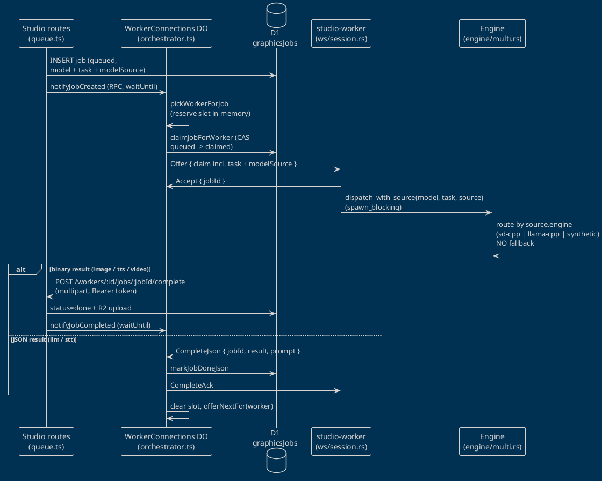

# Flows: studio-worker ↔ minigames studio

Every flow in the worker's architecture and how each one integrates
with the studio (`minigames` repo, `apps/studio`).  Each section
names the implementing files on both sides so the flow can be traced
in code.  Companion to the [architecture overview](overview.md),
which describes the modules; this page describes the *movements*.

Verified against both codebases on 2026-06-11.

## Table of contents

1. [Registration + approval](#1-registration--approval)
2. [WebSocket session lifecycle](#2-websocket-session-lifecycle)
3. [Job offer + dispatch](#3-job-offer--dispatch)
4. [Model provisioning](#4-model-provisioning)
5. [Result delivery](#5-result-delivery)
6. [Failure, reject + retry](#6-failure-reject--retry)
7. [Pause / resume](#7-pause--resume)
8. [Log shipping](#8-log-shipping)
9. [Studio realtime UI broadcast](#9-studio-realtime-ui-broadcast)
10. [Process startup + shutdown](#10-process-startup--shutdown)
11. [Auto-update](#11-auto-update)
12. [Service install + autostart](#12-service-install--autostart)
13. [Desktop UI observation](#13-desktop-ui-observation)
14. [Telemetry](#14-telemetry)

---

## 1. Registration + approval

Operator-gated, no shared secret.  Worker side:
[`src/auto_register.rs`](../../src/auto_register.rs) (state machine,
one HTTP round-trip per `tick()`), [`src/http.rs`](../../src/http.rs)
(`register_request` + `poll_register_status`), orchestrated by
`runtime::ensure_registered` (headless) or the `ui::run` spawn loop
(both poll every 30s).  Studio side:
`apps/studio/src/worker/modules/graphics/routes/workers.ts`
(`workerAgentRoutes` + `workerAdminRoutes`) and `workerAuth.ts`.

```
Worker                                  Studio
──────                                  ──────
generate install_id (UUIDv4) +
registration_secret (256-bit, getrandom)
persist both to config.toml
        │
        │ POST /workers/register-request
        │   { installId, sha256(secret), capabilities, userAgent }
        ├──────────────────────────────► rate-limit by source IP
        │                                dedup on (installId, pending)
        │                                INSERT workerRegistrationRequests
        │ ◄────────────────────────────┤ { requestId: "rr-…", status: pending }
        │
        │ every 30s:
        │ GET /workers/register-requests/:id
        │   Bearer <raw registration_secret>
        ├──────────────────────────────► requireRegistrationSecret verifies hash
        │                                pending  → { status: pending }
        │                                rejected → { status: rejected, reason }
        │                                approved → mint FRESH token, rotate
        │                                  hash on studioWorkers + the request
        │                                  row (poll-after-approve idempotent)
        │ ◄────────────────────────────┤ { status: approved, workerId, authToken }
        │
persist worker_id + auth_token,
clear request_id + secret → Approved
```

The operator decides in the dashboard (`PendingWorkersPanel.tsx` →
`POST /workers/pending/:id/approve|reject`).  Approve inserts a
`studioWorkers` row with the capabilities snapshot and records
`decidedBy`.  Worker-side terminal states: `Approved` falls through
to the WS session; `Rejected` stops the loop until
`studio-worker register --reset`; a `404` on poll drops the stale
request and recreates next tick.

## 2. WebSocket session lifecycle

Worker: [`src/ws/client.rs`](../../src/ws/client.rs) (transport),
[`src/ws/session.rs`](../../src/ws/session.rs) (session +
reconnect), [`src/ws/types.rs`](../../src/ws/types.rs) (frames).
Studio: `routes/workers.ts` (`GET /workers/:id/connect`,
`requireWorkerToken` → `forwardConnect`), the `WorkerConnections`
Durable Object (`WorkerConnections.ts` + `orchestrator.ts` +
`sessionStore.ts`), frame contract in
`src/shared/types/workerWs.ts`.

```
spawn_ws_session loop:
  wait until config has worker_id + auth_token   (poll 1s — lets the
                                                  UI's parallel
                                                  auto-register work)
  connect GET /workers/:id/connect (upgrade)  → DO accepts socket,
                                                unauthenticated session;
                                                an older socket for the
                                                same workerId is closed
                                                4003 duplicate_worker
  send Hello { authToken, capabilities }      → DO sha256-compares vs
                                                studioWorkers.authTokenHash
                                                (constant-time)
  wait for Welcome   ◄─ gate: heartbeat/log pumps DON'T start until
                        Welcome, so interval()'s t=0 tick can't race
                        the async Hello auth ("session not authenticated")
  then concurrently:
    heartbeat pump   every 5s: Heartbeat { capabilities, currentJobId }
                     → DO persists to studioWorkers, replies HeartbeatAck,
                       and self-heals: idle worker + no held slot →
                       offerNextFor (covers missed notifyJobCreated)
    log shipper      every 1s: LogBatch { entries }  → workerLogs D1
    reader           pumps server frames into the dispatch loop;
                     READ_IDLE_TIMEOUT 20s declares a half-open socket dead
    dispatch loop    Offer / Error / acks (see flow 3)
```

Reconnect policy: `Disconnected` backs off `1s × 2^attempt` capped
at 30s, up to `ws_reconnect_attempts` (default 5); a session that
reached Welcome resets the counter, so only consecutive
connect-failures accumulate.  No reconnect on close codes `4001
auth_failed` (operator must `register --reset`), `4003
duplicate_worker`, `4004 worker_deleted`; `4002` is
`protocol_violation`.  Mapping is 1:1 between
`WsCloseCode::from_error_code` (Rust) and `closeCodeForError`
(`workerWs.ts`).  Studio side sweeps stale sessions via a DO alarm
every 10s (heartbeat older than 30s → close + release the claim);
the DO survives hibernation by rebuilding its session map from
`state.getWebSockets()` attachments.

## 3. Job offer + dispatch

The core flow.  Studio: `orchestrator.ts` (offer pipeline),
`candidateSelection.ts` (`pickWorkerForJob` — autoEnabled, idle,
kind match via `taskKinds`, `vramThresholdGb >=
job.vramGbEstimate`, earliest-connected wins),
`repository.ts` (D1 CAS).  Worker: `handle_offer` +
`run_offered_job` in [`src/ws/session.rs`](../../src/ws/session.rs),
engine routing in [`src/engine/multi.rs`](../../src/engine/multi.rs).



Offer-side invariants (all verified in `orchestrator.ts`):

- **In-memory reservation before the D1 CAS** — concurrent
  `notifyJobCreated` calls would otherwise all see the worker idle
  and double-offer; a lost CAS reverts the reservation.
- **`commitOffer` requires `model` + `task` + `modelSource`** on the
  row; anything missing fails the job loudly (`retryable: false`),
  never synthesises a placeholder.
- **One offer in flight per worker** and the next offer is always
  server-driven (`notifyJobCompleted` → `offerNextFor`, or the
  idle-heartbeat self-heal).  The worker deliberately does **not**
  send `ReadyForMore` after completing — the dual trigger raced
  `commitOffer` and produced `accept for unknown jobId` kills.

Worker-side: a busy or paused worker `Reject`s the offer (see flows
6 + 7); otherwise it CAS-flips its `busy` flag, sends `Accept`,
surfaces a `CurrentJob` to the UI observers, and dispatches on a
blocking thread.  `MultiEngine::dispatch_with_source` routes
strictly by `source.engine` — see the
[no-fallback policy](../operations/no-fallback.md).

## 4. Model provisioning

Two nested on-demand downloads, both worker-side, both driven by the
offer's `ModelSource` (see [model-source.md](../runtime/model-source.md)):

1. **Model files** — `ensure_file` in
   [`src/engine/download.rs`](../../src/engine/download.rs): for
   every `ModelFile` missing from `cfg.models_root`, stream the URL
   to `<filename>.part`, verify against `Content-Length`, rename
   atomically.  Path-traversal guarded (`model_cache_path` rejects
   anything but a plain file name).  Cached forever after.
2. **The `sd-cli` binary** — [`src/engine/sd_provision.rs`](../../src/engine/sd_provision.rs):
   on the first image job, resolve `$STUDIO_WORKER_SD_CLI` →
   `<models_root>/bin/sd-cli` → `~/.local/bin` → `$PATH`, else
   download the pinned prebuilt stable-diffusion.cpp zip for this
   platform and extract it flat into `<models_root>/bin/`.  Vulkan
   loader preflighted via dlopen.  Deep dive:
   [sdcpp.md](../engines/sdcpp.md).

Studio side of the contract: the `studioModels` D1 table (admin CRUD
in `routes/models.ts`, seeded by migration `0017_seed_registry.sql`)
is resolved by `resolveModelSourceFromDatabase` at the
create / promote / retry write-sites in `routes/queue.ts` and
persisted onto `graphicsJobs.modelSource`.  A missing or disabled
model row is a 400 at queue time — never a half-built claim.

## 5. Result delivery

Split by payload type (R2 doesn't fit in WS frames):

| Result | Path | Studio handler |
|---|---|---|
| `Image` / `AudioTts` / `Video` (bytes) | HTTP `POST /workers/:id/jobs/:jobId/complete` multipart (`image`, `ext`, `prompt`, optional `generationMeta` fields), Bearer auth | `queueWorkerRoutes` in `routes/queue.ts`: verifies the row is claimed by this worker (409 otherwise), streams to R2 via `uploadAsset`, marks `done`, clears `currentJobId`, then `waitUntil(notifyJobCompleted)` nudges the DO for the next offer |
| `Llm` / `AudioStt` (JSON) | WS `CompleteJson { jobId, result, prompt }` | `onCompleteJson` in `orchestrator.ts`: `markJobDoneJson`, clears the slot, `CompleteAck`, `offerNextFor` |

The **full** prompt travels with the result (the studio persists it
onto the row); the worker's 200-char `truncate_prompt` preview is
UI-only — mixing the two once mangled every prompt in the DB.  A
failed upload / dropped frame is reported as `Fail { retryable:
true }`, never a false-positive `Completed`.

## 6. Failure, reject + retry

Worker reports, studio decides.  Studio: `repository.ts`
(`releaseClaim`, `failJob`, `requeueJob`, `MAX_ATTEMPTS_DEFAULT`),
`orchestrator.ts` (`onFail`, `onReject`, `handleWebSocketClose`,
`handleAlarm`).

| Trigger | Worker sends | Studio behaviour |
|---|---|---|
| Engine error (generic) | `Fail { retryable: true }` | `failJob`: requeue with `attempts+1`, terminal `failed` once attempts exhaust |
| Engine `UnsupportedKind` / missing engine | `Fail { retryable: false }` | terminal `failed` immediately |
| Offer while busy / paused | `Reject { reason }` | `isTransientReject` matches "already busy" / "paused by operator" / "in-flight job" → requeue **without** counting an attempt and **without** immediate re-offer (would spin); non-transient reject → `releaseClaim` + offer elsewhere |
| WS close mid-job | (connection drop) | `handleWebSocketClose` releases the claim (requeue or fail by attempts) |
| Stale heartbeat (>30s) | (silence) | DO alarm closes the session, claim released on close |
| `Accept`/`Fail`/`CompleteJson` for a jobId the DO doesn't hold | — | `protocol_violation` error frame + close 4002 |

Operator-level recovery (zombie claimed rows, bad batches) is a
manual D1 playbook: [recovery.md](../operations/recovery.md).

## 7. Pause / resume

Runtime-only `Arc<AtomicBool>` — full description in
[pause-resume.md](../runtime/pause-resume.md).  Flow: UI Status tab
or tray menu flips the flag → next heartbeat advertises
`autoEnabled: false` → studio's `pickWorkerForJob` skips the worker
→ any offer racing the flag flip is rejected with `"worker paused by
operator"`, which the studio treats as transient (no attempt
counted).  In-flight work always finishes.  Restarts come up
unpaused by design.

## 8. Log shipping

Three consumers of one bounded buffer
(`push_log_with_observers` in [`src/runtime.rs`](../../src/runtime.rs)):

1. **stderr** — every entry also lands as a `tracing` event
   (`RUST_LOG=studio_worker=debug`).
2. **UI Logs tab** — `WorkerObservers.recent_logs` ring (1000
   entries) so the tab doesn't blank when the shipper drains.
3. **Studio** — the WS log-shipper pump drains the buffer every 1s
   into `LogBatch` frames; the DO's `onLogBatch` →
   `repo.ingestLogs` → `workerLogs` D1 table → dashboard LogViewer.

## 9. Studio realtime UI broadcast

Studio-internal but part of the integration: the same
`WorkerConnections` DO also accepts **browser** WebSocket clients
(tagged `client`, write-only, `routes/realtime.ts`).  Every state
transition the worker causes — connect, heartbeat, claim, complete,
fail, disconnect — fans a `workersChanged` / `jobsChanged`
`StudioRealtimeEvent` out to every dashboard tab, so the operator
sees jobs flip queued → claimed → done live, with no polling.

## 10. Process startup + shutdown

Worker-side only.  [`src/main.rs`](../../src/main.rs): tracing
subscriber → rustls `CryptoProvider` install (panic-prevention for
the first TLS handshake) → Sentry guard → tokio runtime →
`run_cli` ([`src/lib.rs`](../../src/lib.rs)) dispatches the clap
command ([`src/cli.rs`](../../src/cli.rs)).

`runtime::run` (headless): `config::load` → startup banner →
`ensure_registered` (flow 1, blocking until Approved) → `run_loops`
spawns the WS session (flow 2) + auto-updater (flow 11).  `ui::run`
(desktop): same loops, but auto-register runs in parallel with the
WS session — the session's wait-for-credentials poll makes that
safe — and the main thread is handed to eframe.

Shutdown: SIGTERM / SIGINT / tray-Quit sets the shared `stop` flag;
every pump re-polls it on a 250ms tick (`wait_with_stop`), the
session closes cleanly, an in-flight job gets ~5s to finish.  The
service manager (flow 12) restarts the binary when the session loop
exhausts its reconnect budget.

## 11. Auto-update

[`src/update.rs`](../../src/update.rs) + `spawn_auto_updater` in
`runtime.rs`.  Every `auto_update_interval_secs` (default 30 min),
when enabled and not mid-job: poll the GitHub Releases feed →
compare semver vs `AGENT_VERSION` → on newer, download the
cargo-dist installer, run it, `execvp` into the new binary (unix) or
spawn-successor + exit (Windows).  Any failure leaves the old
version running and retries next interval.  Manual check via
`check-update` CLI or the UI About tab.  No studio involvement —
the feed is GitHub.

## 12. Service install + autostart

Two coexisting worker-side mechanisms, no studio involvement:

- **`install-service`** ([`src/service.rs`](../../src/service.rs)):
  systemd `--user` unit / launchd plist / Windows scheduled-task XML
  for headless rigs.
- **Autostart-on-login** ([`src/autostart.rs`](../../src/autostart.rs)):
  `.desktop` entry / LaunchAgent / HKCU `…\Run` registry value,
  reconciled with the `auto_start` config flag on every `ui::run`
  launch.

## 13. Desktop UI observation

The UI never talks to the studio directly; it reads the shared
[`WorkerObservers`](../../src/runtime.rs) slots the runtime writes:
`current_job` (set on Accept, cleared after completion),
`recent_jobs` (ring of 50), `last_heartbeat` (written on every ack /
failure — drives the tray icon's idle / busy / disconnected
variants), `recent_logs`, plus the shared registration state for the
pre-approval Status views.  Writes flow the other way through the
`paused` flag (flow 7) and `config::save` from the Config tab.
Completion / failure notifications go through the `Notifier` trait
([`src/ui/notifier.rs`](../../src/ui/notifier.rs)), opt-in per event.

## 14. Telemetry

[`src/telemetry.rs`](../../src/telemetry.rs), opt-in via
`SENTRY_DSN`: panics + `tracing::error!` events flow to Sentry with
`warn!` breadcrumbs, tagged `release = studio-worker@<version>` +
`server_name`.  Credential fields are redacted from all config
tracing (regression-tested in
[`tests/config_tracing.rs`](../../tests/config_tracing.rs)).
Independent of the studio-bound log shipping (flow 8).
