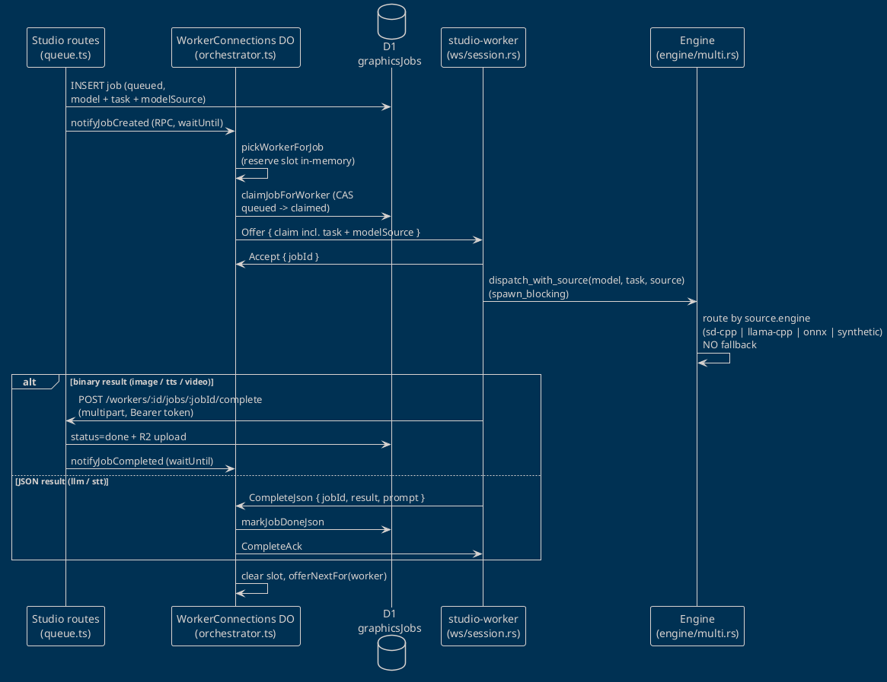

# Flows: studio-worker ↔ minigames studio

Every flow in the worker's architecture and how each one integrates
with the studio (`minigames` repo, `apps/studio`).  Each section
names the implementing files on both sides so the flow can be traced
in code.  Companion to the [architecture overview](overview.md),
which describes the modules; this page describes the *movements*.

Verified against both codebases on 2026-06-11.

## Table of contents

1. [Registration + approval](#1-registration--approval)
2. [WebSocket session lifecycle](#2-websocket-session-lifecycle)
3. [Job offer + dispatch](#3-job-offer--dispatch)
4. [Model provisioning](#4-model-provisioning)
5. [Result delivery](#5-result-delivery)
6. [Failure, reject + retry](#6-failure-reject--retry)
7. [Pause / resume](#7-pause--resume)
8. [Log shipping](#8-log-shipping)
9. [Studio realtime UI broadcast](#9-studio-realtime-ui-broadcast)
10. [Process startup + shutdown](#10-process-startup--shutdown)
11. [Auto-update](#11-auto-update)
12. [Service install + autostart](#12-service-install--autostart)
13. [Tray UI observation](#13-tray-ui-observation)
14. [Telemetry](#14-telemetry)
15. [Model lifecycle](#15-model-lifecycle)

---

## 1. Registration + approval

Operator-gated, no shared secret.  Worker side:
[`src/auto_register.rs`](../../src/auto_register.rs) (state machine,
one HTTP round-trip per `tick()`), [`src/http.rs`](../../src/http.rs)
(`register_request` + `poll_register_status`), orchestrated by
`runtime::ensure_registered` inside the daemon's `serve_studio` (polls
every 30s).  Studio side:
`apps/studio/src/worker/modules/graphics/routes/workers.ts`
(`workerAgentRoutes` + `workerAdminRoutes`) and `workerAuth.ts`.

```
Worker                                  Studio
──────                                  ──────
generate install_id (UUIDv4) +
registration_secret (256-bit, getrandom)
persist both to config.toml
        │
        │ POST /workers/register-request
        │   { installId, sha256(secret), capabilities, userAgent }
        ├──────────────────────────────► rate-limit by source IP
        │                                dedup on (installId, pending)
        │                                INSERT workerRegistrationRequests
        │ ◄────────────────────────────┤ { requestId: "rr-…", status: pending }
        │
        │ every 30s:
        │ GET /workers/register-requests/:id
        │   Bearer <raw registration_secret>
        ├──────────────────────────────► requireRegistrationSecret verifies hash
        │                                pending  → { status: pending }
        │                                rejected → { status: rejected, reason }
        │                                approved → mint FRESH token, rotate
        │                                  hash on studioWorkers + the request
        │                                  row (poll-after-approve idempotent)
        │ ◄────────────────────────────┤ { status: approved, workerId, authToken }
        │
persist worker_id + auth_token,
clear request_id + secret → Approved
```

The operator decides in the dashboard (`PendingWorkersPanel.tsx` →
`POST /workers/pending/:id/approve|reject`).  Approve inserts a
`studioWorkers` row with the capabilities snapshot and records
`decidedBy`.  Worker-side terminal states: `Approved` falls through
to the WS session; `Rejected` stops the loop until
a reset (`studio-worker register --reset`, or Reset registration in the
tray UI via `POST /daemon/registration/reset`, which needs no restart);
the daemon keeps serving locally meanwhile.  A `404` on poll drops the
stale request and recreates next tick.

## 2. WebSocket session lifecycle

Worker: [`src/ws/client.rs`](../../src/ws/client.rs) (transport),
[`src/ws/session.rs`](../../src/ws/session.rs) (session +
reconnect), [`src/ws/types.rs`](../../src/ws/types.rs) (frames).
Studio: `routes/workers.ts` (`GET /workers/:id/connect`,
`requireWorkerToken` → `forwardConnect`), the `WorkerConnections`
Durable Object (`WorkerConnections.ts` + `orchestrator.ts` +
`sessionStore.ts`), frame contract in
`src/shared/types/workerWs.ts`.

```
spawn_ws_session loop:
  wait until config has worker_id + auth_token   (poll 1s)
  connect GET /workers/:id/connect (upgrade)  → DO accepts socket,
                                                unauthenticated session;
                                                an older socket for the
                                                same workerId is closed
                                                4003 duplicate_worker
  send Hello { authToken, capabilities }      → DO sha256-compares vs
                                                studioWorkers.authTokenHash
                                                (constant-time)
  wait for Welcome   ◄─ gate: heartbeat/log pumps DON'T start until
                        Welcome, so interval()'s t=0 tick can't race
                        the async Hello auth ("session not authenticated")
  then concurrently:
    heartbeat pump   every 5s: Heartbeat { capabilities, currentJobId }
                     → DO persists to studioWorkers, replies HeartbeatAck,
                       and self-heals: idle worker + no held slot →
                       offerNextFor (covers missed notifyJobCreated)
    log shipper      every 1s: LogBatch { entries }  → workerLogs D1
    reader           pumps server frames into the dispatch loop;
                     READ_IDLE_TIMEOUT 20s declares a half-open socket dead
    dispatch loop    Offer / Error / acks (see flow 3)
```

Reconnect policy: `Disconnected` backs off `1s × 2^attempt` capped
at 30s, up to `ws_reconnect_attempts` (default 5); a session that
reached Welcome resets the counter, so only consecutive
connect-failures accumulate.  No reconnect on close codes `4001
auth_failed` (operator must `register --reset`), `4003
duplicate_worker`, `4004 worker_deleted`; `4002` is
`protocol_violation`.  Mapping is 1:1 between
`WsCloseCode::from_error_code` (Rust) and `closeCodeForError`
(`workerWs.ts`).  Studio side sweeps stale sessions via a DO alarm
every 10s (heartbeat older than 30s → close + release the claim);
the DO survives hibernation by rebuilding its session map from
`state.getWebSockets()` attachments.

## 3. Job offer + dispatch

The core flow.  Studio: `orchestrator.ts` (offer pipeline),
`candidateSelection.ts` (`pickWorkerForJob` — autoEnabled, idle,
kind match via `taskKinds`, `vramThresholdGb >=
job.vramGbEstimate`, earliest-connected wins),
`repository.ts` (D1 CAS).  Worker: `handle_offer` +
`run_offered_job` in [`src/ws/session.rs`](../../src/ws/session.rs),
engine routing in [`src/engine/multi.rs`](../../src/engine/multi.rs).


```plantuml
@startuml
!theme blueprint
participant "Studio routes\n(queue.ts)" as Q
participant "WorkerConnections DO\n(orchestrator.ts)" as DO
database "D1\ngraphicsJobs" as D1
participant "studio-worker\n(ws/session.rs)" as W
participant "Engine\n(engine/multi.rs)" as E

Q -> D1 : INSERT job (queued,\nmodel + task + modelSource)
Q -> DO : notifyJobCreated (RPC, waitUntil)
DO -> DO : pickWorkerForJob\n(reserve slot in-memory)
DO -> D1 : claimJobForWorker (CAS\nqueued -> claimed)
DO -> W : Offer { claim incl. task + modelSource }
W -> DO : Accept { jobId }
W -> E : dispatch_with_source(model, task, source)\n(spawn_blocking)
E -> E : route by source.engine\n(sd-cpp | llama-cpp | onnx | synthetic)\nNO fallback
alt binary result (image / tts / video)
  W -> Q : POST /workers/:id/jobs/:jobId/complete\n(multipart, Bearer token)
  Q -> D1 : status=done + R2 upload
  Q -> DO : notifyJobCompleted (waitUntil)
else JSON result (llm / stt)
  W -> DO : CompleteJson { jobId, result, prompt }
  DO -> D1 : markJobDoneJson
  DO -> W : CompleteAck
end
DO -> DO : clear slot, offerNextFor(worker)
@enduml
```

Offer-side invariants (all verified in `orchestrator.ts`):

- **In-memory reservation before the D1 CAS** — concurrent
  `notifyJobCreated` calls would otherwise all see the worker idle
  and double-offer; a lost CAS reverts the reservation.
- **`commitOffer` requires `model` + `task` + `modelSource`** on the
  row; anything missing fails the job loudly (`retryable: false`),
  never synthesises a placeholder.
- **One offer in flight per worker** and the next offer is always
  server-driven (`notifyJobCompleted` → `offerNextFor`, or the
  idle-heartbeat self-heal).  The worker deliberately does **not**
  send `ReadyForMore` after completing — the dual trigger raced
  `commitOffer` and produced `accept for unknown jobId` kills.

Worker-side: a busy or paused worker `Reject`s the offer (see flows
6 + 7); otherwise it CAS-flips its `busy` flag, sends `Accept`,
surfaces a `CurrentJob` to the UI observers, and dispatches on a
blocking thread.  `MultiEngine::dispatch_with_source` routes
strictly by `source.engine` — see the
[no-fallback policy](../operations/no-fallback.md).

## 4. Model provisioning

Two nested on-demand downloads, both worker-side, both driven by the
offer's `ModelSource` (see [model-source.md](../runtime/model-source.md)):

1. **Model files** — `ensure_file` in
   [`src/engine/download.rs`](../../src/engine/download.rs): for
   every `ModelFile` missing from `cfg.models_root`, stream the URL
   to `<filename>.part`, verify against `Content-Length` (and the
   registry's `sha256` when the row carries one — the body is hashed
   while it streams), rename atomically.  Path-traversal guarded
   (`model_cache_path` rejects anything but a plain file name).
   Cached forever after.
2. **The `sd-cli` binary** — [`src/engine/sd_provision.rs`](../../src/engine/sd_provision.rs):
   on the first image job, resolve `$STUDIO_WORKER_SD_CLI` →
   `<models_root>/bin/sd-cli` → `~/.local/bin` → `$PATH`, else
   download the pinned prebuilt stable-diffusion.cpp zip for this
   platform and extract it flat into `<models_root>/bin/`.  Vulkan
   loader preflighted via dlopen.  Deep dive:
   [sdcpp.md](../engines/sdcpp.md).

Studio side of the contract: the `studioModels` D1 table (admin CRUD
in `routes/models.ts`, seeded by migration `0017_seed_registry.sql`)
is resolved by `resolveModelSourceFromDatabase` at the
create / promote / retry write-sites in `routes/queue.ts` and
persisted onto `graphicsJobs.modelSource`.  A missing or disabled
model row is a 400 at queue time — never a half-built claim.

## 5. Result delivery

Split by payload type (R2 doesn't fit in WS frames):

| Result | Path | Studio handler |
|---|---|---|
| `Image` / `AudioTts` / `Video` (bytes) | HTTP `POST /workers/:id/jobs/:jobId/complete` multipart (`image`, `ext`, `prompt`, optional `generationMeta` fields), Bearer auth | `queueWorkerRoutes` in `routes/queue.ts`: verifies the row is claimed by this worker (409 otherwise), streams to R2 via `uploadAsset`, marks `done`, clears `currentJobId`, then `waitUntil(notifyJobCompleted)` nudges the DO for the next offer |
| `Llm` / `AudioStt` (JSON) | WS `CompleteJson { jobId, result, prompt }` | `onCompleteJson` in `orchestrator.ts`: `markJobDoneJson`, clears the slot, `CompleteAck`, `offerNextFor` |

The **full** prompt travels with the result (the studio persists it
onto the row); the worker's 200-char `truncate_prompt` preview is
UI-only — mixing the two once mangled every prompt in the DB.  A
failed upload / dropped frame is reported as `Fail { retryable:
true }`, never a false-positive `Completed`.

## 6. Failure, reject + retry

Worker reports, studio decides.  Studio: `repository.ts`
(`releaseClaim`, `failJob`, `requeueJob`, `MAX_ATTEMPTS_DEFAULT`),
`orchestrator.ts` (`onFail`, `onReject`, `handleWebSocketClose`,
`handleAlarm`).

| Trigger | Worker sends | Studio behaviour |
|---|---|---|
| Engine error (generic) | `Fail { retryable: true }` | `failJob`: requeue with `attempts+1`, terminal `failed` once attempts exhaust |
| Engine `UnsupportedKind` / missing engine | `Fail { retryable: false }` | terminal `failed` immediately |
| Offer while busy / paused | `Reject { reason, code: busy\|paused }` | `isTransientReject` branches on the structured `code` (regex on the free-text reason kept as fallback for old workers) → requeue **without** counting an attempt and **without** immediate re-offer (would spin); non-transient reject → `releaseClaim` + offer elsewhere |
| WS close mid-job | (connection drop) | `handleWebSocketClose` releases the claim (requeue or fail by attempts) |
| Stale heartbeat (>30s) | (silence) | DO alarm closes the session, claim released on close |
| `Accept`/`Fail`/`CompleteJson` for a jobId the DO doesn't hold | — | `protocol_violation` error frame + close 4002 |

Operator-level recovery (zombie claimed rows, bad batches) is a
manual D1 playbook: [recovery.md](../operations/recovery.md).

## 7. Pause / resume

Runtime-only `Arc<AtomicBool>` in the daemon — full description in
[pause-resume.md](../runtime/pause-resume.md).  Flow: the tray UI's Status
tab or tray menu sends `POST /daemon/pause` / `resume`, which flips the flag → next heartbeat advertises
`autoEnabled: false` → studio's `pickWorkerForJob` skips the worker
→ any offer racing the flag flip is rejected with `"worker paused by
operator"`, which the studio treats as transient (no attempt
counted).  In-flight work always finishes.  Restarts come up
unpaused by design.

## 8. Log shipping

Three consumers of one bounded buffer
(`push_log_with_observers` in [`src/runtime.rs`](../../src/runtime.rs)):

1. **stderr** — every entry also lands as a `tracing` event
   (`RUST_LOG=studio_worker=debug`).
2. **Tray UI Logs page** — `WorkerObservers.recent_logs` ring (1000
   entries) so the tab doesn't blank when the shipper drains.  The
   daemon's own info-and-up events land in the same ring
   (`job_log::WorkerLogLayer`); the UI reads it with
   `GET /daemon/logs?after=<seq>`.
3. **Studio** — the WS log-shipper pump drains the buffer every 1s
   into `LogBatch` frames; the DO's `onLogBatch` →
   `repo.ingestLogs` → `workerLogs` D1 table → dashboard LogViewer.

## 9. Studio realtime UI broadcast

Studio-internal but part of the integration: the same
`WorkerConnections` DO also accepts **browser** WebSocket clients
(tagged `client`, write-only, `routes/realtime.ts`).  Every state
transition the worker causes — connect, heartbeat, claim, complete,
fail, disconnect — fans a `workersChanged` / `jobsChanged`
`StudioRealtimeEvent` out to every dashboard tab, so the operator
sees jobs flip queued → claimed → done live, with no polling.

## 10. Process startup + shutdown

Worker-side only.  [`src/main.rs`](../../src/main.rs): tracing
subscriber → rustls `CryptoProvider` install (panic-prevention for
the first TLS handshake) → Sentry guard → tokio runtime →
`run_cli` ([`src/lib.rs`](../../src/lib.rs)) dispatches the clap
command ([`src/cli.rs`](../../src/cli.rs)).

`runtime::run` (the daemon): `config::load` → daemon lock (a second
daemon for the same config exits 0) → startup banner → local API + model
host + stream listener → `serve_studio`: `ensure_registered` (flow 1) →
`run_loops` spawns the WS session (flow 2) + auto-updater (flow 11).
`ui::run` (the tray UI) runs no loops of its own: see flow 13.

Shutdown: SIGTERM / SIGINT / `POST /daemon/shutdown` (tray Quit) sets the
shared `stop` flag;
every pump re-polls it on a 250ms tick (`wait_with_stop`), the
session closes cleanly, an in-flight job gets ~5s to finish.  The
service manager (flow 12) restarts the binary when the session loop
exhausts its reconnect budget.

## 11. Auto-update

[`src/update.rs`](../../src/update.rs) + `spawn_auto_updater` in
`runtime.rs`.  Every `auto_update_interval_secs` (default 30 min),
when enabled and not mid-job: poll the GitHub Releases feed →
compare semver vs `AGENT_VERSION` → on newer, download the
cargo-dist installer, run it for the build variant this binary runs as
(`cpu` or `cuda`; see [release](../operations/release.md#cuda-variant)), `execvp` into the new binary (unix) or
spawn-successor + exit (Windows).  Windows-specific: the running exe
is **parked** (renamed to `<exe>.old`) before the installer runs —
NTFS locks a running binary against overwrite but allows the rename
— with rollback on failure and cleanup of the parked file on the
next start.  Any failure leaves the old version running and retries
next interval.  Manual check via
`check-update` CLI or the UI Worker page.  No studio involvement —
the feed is GitHub.

## 12. Service install + autostart

Two coexisting worker-side mechanisms, no studio involvement:

- **`install-service`** ([`src/service.rs`](../../src/service.rs)):
  systemd `--user` unit / launchd plist / Windows scheduled-task XML
  for headless rigs.
- **Tray UI at login** ([`src/autostart.rs`](../../src/autostart.rs)):
  `.desktop` entry / LaunchAgent / HKCU `…\Run` registry value, always
  installed (and kept pointing at the current executable) by every
  `ui::run`.  The tray UI starts the daemon when none runs; the daemon
  lock keeps it to one per config directory.

## 13. Tray UI observation

The tray UI is a client of the daemon; it never talks to the studio and
never runs a job.  Design: [daemon and tray UI](../runtime/daemon-and-tray.md).

```
ui::run
  single_instance::acquire              <config dir>/ui.lock; held → write ui.raise,
                                          log op="single_instance", exit 0
  autostart::ensure                     login entry, always
  Poller thread, every 1 s:
    read <config dir>/local-api.json    URL + token (fresh each time)
    GET /daemon/status                  snapshot → Replica (observers, config,
                                          registration, busy, paused)
    GET /daemon/logs?after=<seq>        new worker log entries
    GET /models                         catalogue with state, residency, since
    GET /jobs/<selected>/log            the selected job's log
    GET /jobs/<id>/thumbnail            thumbnails the replica lacks
    on failure: empty the Replica (no stale data);
      daemon lock held → link "starting"
      lock free 20 s   → start `studio-worker --config <path> run`
                         (detached, output → <config dir>/daemon.log),
                         at most every 10 s; the grace outlasts a
                         supervisor's restart gap
  raise watcher, every 250 ms:          ui.raise present → delete it, show +
                                          focus the window (op="raise")
  eframe window + tray: rail, pulse header, status bar; pages render the
    Replica; theme + reduce motion + notifications from <config dir>/ui.toml
    no usable display → op="display_wait", wait 2 s…60 s, restart in place
  actions (helper threads) → POST /daemon/pause|resume,
    PUT /daemon/config, POST /models/:id/load|unload,
    POST /daemon/registration/reset, POST /daemon/shutdown (Quit)
```

Every job the daemon runs (flow 3 offers, local API requests, chats on a
loaded model's lane, streaming speech sessions) goes through a `JobRun`:
listed as running, run inside a `job` tracing span whose events form the
job's log, thumbnailed when it returns an image, recorded in its ring.
Completion / failure notifications go through the `Notifier` trait
([`src/ui/notifier.rs`](../../src/ui/notifier.rs)), opt-in per event.

## 14. Telemetry

[`src/telemetry.rs`](../../src/telemetry.rs), opt-in via
`SENTRY_DSN`: panics + `tracing::error!` events flow to Sentry with
`warn!` breadcrumbs, tagged `release = studio-worker@<version>` +
`server_name`.  Credential fields are redacted from all config
tracing (regression-tested in
[`tests/config_tracing.rs`](../../tests/config_tracing.rs)).
Independent of the studio-bound log shipping (flow 8).

---

## 15. Model lifecycle

Local-only (the studio is not involved).

1. `POST /models/:id/load` -> `ModelHost::load`: unknown / disabled ids are refused;
   exclusive-group members are marked for swap; admission probes free device memory
   (`nvidia-smi`, AMD sysfs, else accounting) and refuses with `insufficient_memory`.
2. Residency is saved (`residency.json`), the lifecycle moves to `loading` and a load
   thread waits for any swap-out, then calls the engine's loader (`loaders.rs`), which
   downloads and loads the weights.
3. `loaded`: requests for the model run on its lane (`ModelHost::with_lane`), e.g.
   `/v1/chat/completions` via `local::chat_on_lane`; they are recorded in the local queue.
4. `POST /models/:id/unload`: residency cleared, `unloading`; the lane's cancel flag is
   raised, the in-flight request drains (bounded), the weights are dropped, `unloaded`.
5. Startup: `spawn_local_api` builds the host and calls `restore_residents`.
6. The tray UI's Models page shows each model's state and calls the same load / unload
   routes; `GET /models` also says whether the model's engine has an in-process loader
   (`loadable`).

Every transition logs `model state changed` (target `studio_worker::lifecycle`) with
`op`, `model`, `from`, `to`; refusals log `load refused`.
